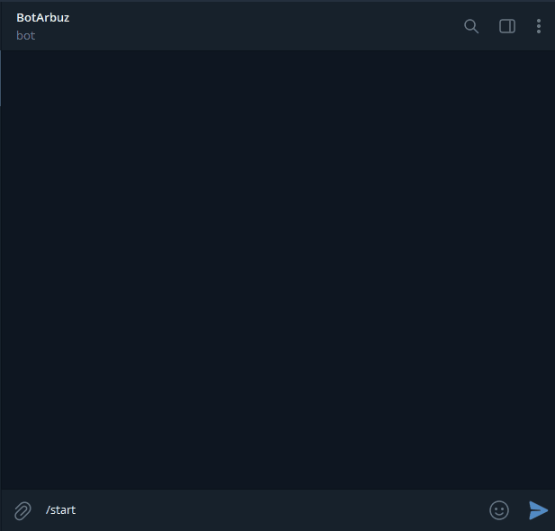

# tg-crypto-bot

Telegram бот для просмотра изменения цен криптовалюты за указанный период

## Функционал:
Доступны 3 команды:
* /d (/day) - изменение цены за день
* /w (/week) - изменение цены за неделю
* /m (/month) - изменение цены за месяц



## Настройка конфига
Переименуйте файл .env.example в .env и укажите в нем токен бота и ваш ID в Telegram
```
TOKEN = токен бота
ADMIN_ID = ID администратора
```

## Запуск с использованием Docker-контейнера
* Создание Docker-образа
    ```
    docker build -t crypto-bot .
    ```
* Запуск Docker-контейнера
    ```
    docker run -d --restart=always crypto-bot
    ```

## Настройка и запуск вручную
* Настройка виртуального окружения и установка зависимостей
    ```
    python -m venv venv
  
    venv\Scripts\activate.bat - для Windows

    source venv/bin/activate - для Linux и MacOS
  
    python -m pip install -r requirements.txt
    ```

* Запуск
    ```
    python app/bot.py
    ```
