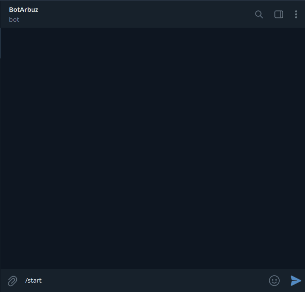

<h1>tg-exchange-rate</h1>
<hr>
<h2>Описание</h2>
Телеграм бот, демонстрирующий график изменения стоимости криптовалют.


<h2>Настройка и установка</h2>

```
$ git clone https://github.com/profatsky/tg-exchange-rate.git

$ cd tg-exchange-rate

$ python3 -m pip install -r requirements.txt
```
После клонирования репозитория переименуйте файл .env.example в .env и укажите необходимые
значения: токен бота и id администратора.
